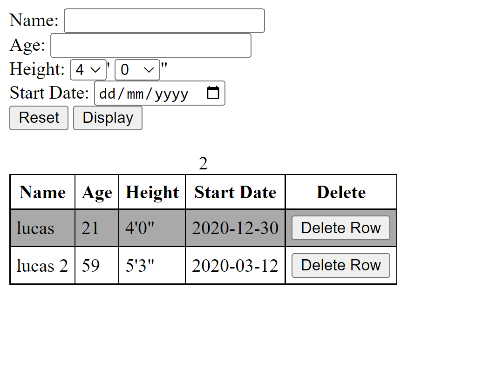
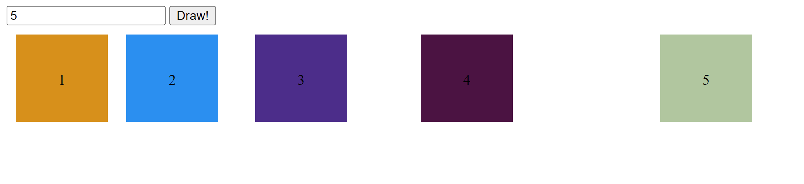
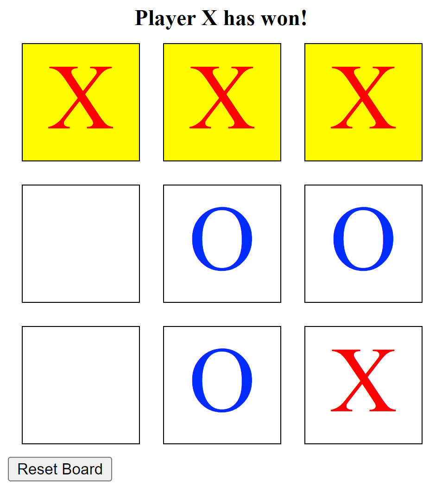

# CO323-Databases-and-the-Web-Assessments-1-and-2

## Assessment 1- Web Development
### Question 1- Input Form
Create a web page that provides an input form for registering users to a gym. The form should ask for the user’s name, age, height (via two drop downs for feet and inches between 4' – 6'11''), and start date (via a date input). Provide two buttons, a “Reset” button, and a “Display” button with the following behaviour:
- Create an empty table below the form, where each column of the table corresponds to one of theinput fields.
- When “Display” is clicked, add a new row to the table and clear the form – each cell of the row should correspond to one of the input fields from the form. Each set of data entered by the user  should add a new row to the table. Rows of the table should have alternating background colours.
- Before adding a new row, input from the user should be validated. Age should be between 18–60 and the start date should be in 2020.
- “Reset” button should clear the form.
- Each added table row should have a cell containing a “Delete” button, that when clicked, removes the row from the table.
- You should also include a piece of text on the caption of the table that provides a counter of the number of data rows in the table.

### Question 2- Boxes 
Create a web page that generates a series a of small boxes, where the number of boxes is given by the user via a text input box. Incorporate the following behaviour:
- Set the background of each box to a random colour.
- Number the boxes in consecutive integers.
- Set the margin-left of each box to be double the previous boxs margin, where the first box has margin-left 5px.
- Clear the old boxes when a new input is given by the user.

### Question 3- Tic-Tac-Toe
The following list describes the expected behaviour:
- Create the “game board” which comprises a 3x3 grid of boxes. 
- Provide the following behaviour: when a box is clicked, it is filled with either an X or O. When another box is clicked, it should then be filled with the alternate marker for the other player. Make sure that a box cannot be changed from an X or O once it has been clicked.
- After each user update of a box, provide a function that checks whether the winning condition has been met and provides a message if so. Consider the various possible winning conditions and how
to write a function that concisely checks these. No further player moves should be allowed after the winning condition is reached.
If there are no more moves and a player has not won, display an appropriate message.
- Add a “Reset” button to clear the game board and restart the game.
- Add some CSS styling to distinguish between Xs and Os, place Xs and Os in the centre of the boxes with big enough fonts, and clearly show the winning boxes.

---
## Assessment 2- SQL

For this assessment I had to write a series of SQL statements. 

---
